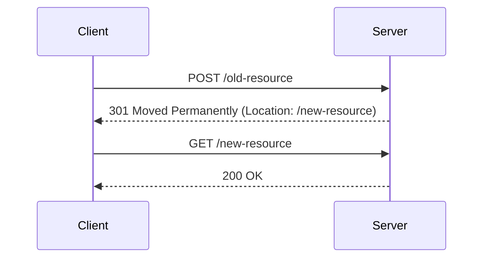
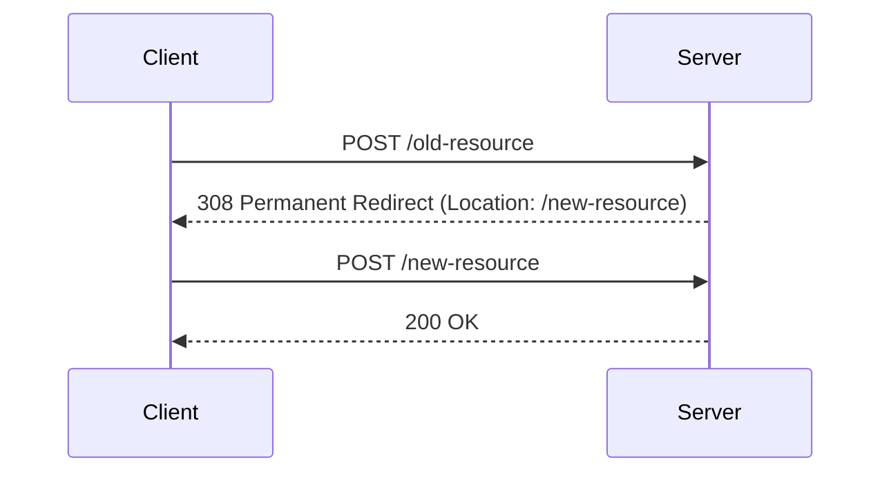

## はじめに

本稿ではレスポンスにLocationフィールドを使用するステータスコード(301, 302 , 307, 308, 303)や、特に使われるところを見かけない303について確認したことや考えたことをまとめる。

## リダイレクトとは何か

[RFC7231 | 6.4.  Redirection 3xx](https://datatracker.ietf.org/doc/html/rfc7231#section-6.4)によると、ステータスコード3xxはリクエストを満たすためにユーザーエージェントがさらなるアクションが必要であることを示している。

そして、リダイレクトには以下の種類があると書かれている。

1. リソースが別のURIで利用できる可能性があることをLocationフィールドで示す(ex. 301, 302, 307)
1. マッチするリソースの選択肢を提供する(ex. 300)
1. リクエストに対する間接的な応答を表す、Locationフィールドで識別される別のリソースへのリダイレクト(ex. 303)
1. 以前にキャッシュされた結果へのリダイレクト(ex. 304)

以下、本稿ではLocationヘッダーにURIを指定する1つ目と3つ目について見ていくこととする。

ここからは、一旦[mdn web docs | HTTP のリダイレクト](https://developer.mozilla.org/ja/docs/Web/HTTP/Redirections)での分類に従って理解していく。

## 恒久的リダイレクト(301, 308)と一時的リダイレクト(302, 303, 307)の違い

[mdn web docs | 恒久的リダイレクト](https://developer.mozilla.org/ja/docs/Web/HTTP/Redirections#%E6%81%92%E4%B9%85%E7%9A%84%E3%83%AA%E3%83%80%E3%82%A4%E3%83%AC%E3%82%AF%E3%83%88)や[mdn web docs | 一時的リダイレクト](https://developer.mozilla.org/ja/docs/Web/HTTP/Redirections#%E4%B8%80%E6%99%82%E7%9A%84%E3%83%AA%E3%83%80%E3%82%A4%E3%83%AC%E3%82%AF%E3%83%88)に書いてあるとおりの分類。

検索エンジンやブックマークで見てほしい参照先が、リダイレクト前なのか後なのかというところで恒久的、一時的のどちらを使うかがわかれる。
例えば、元々運営していたWebサイトを別のURLに移動した場合、以前使用したURLを使う予定は永遠にないため、この場合は恒久的リダイレクトを使うこととなる。
一方、メンテナンス等で一時的に別ページを表示したい場合や、認証関連のAPIで最終的に別のURLに遷移させたいが、元のURLへのリクエストが最初に行われる前提になっている場合は一時的リダイレクトを使うこととなる。

## リダイレクト前後でのリクエストメソッドが変わる可能性がある(301, 302, 303)、変わらない(307, 308)の違い

例えば、レスポンスコード301と308は同じ恒久的リダイレクトだが、301はリダイレクト後のリクエストのメソッドが変わる可能性がある。
下記の301の例では、最初POSTでリクエストをしているが、リダイレクト後はGETでリクエストしている。

一方、308は変わらない。
下記の例では、最初POSTでリクエストし、リダイレクト後もPOSTでリクエストしている。

後者の使用するメソッドを維持したリダイレクトは、APIの移転やメンテナンスなどで役に立つ。

302と307は一時的リダイレクトである点は同じだが、301と308の関係と同じでリクエストメソッドが変わる可能性の有無の点で異なる。

ここまでで、301/302/307/308の整理はできた。が、303に対する説明ができていない。

## 303は自身のリソースに直接的な結果を持ち得ないときに使うもの

mdnに関する303の記載では、どのように使うか断片的には理解できたが、すっきりしなかった。
[RFC7231 | 6.4.4.  303 See Other](https://datatracker.ietf.org/doc/html/rfc7231#section-6.4.4)を見ると(少なくとも私には一見してだと)理解が難しい内容があったが、以下のChatGPTとの問答により、下記の箇条書きの通り理解した。

https://chatgpt.com/share/dc319553-98ac-4dc4-a4e3-9d5d287514fd

- See Otherとあるとおり、他のリソースに元のリクエストに対するに直接的な答えがある場合に使われるもの。つまり自身のリソースでは直接的な結果を持ち得ないときに使うべきもの。
- 最終的に取得する結果はGETで得られるものなのでリダイレクト後のメソッドはGETのみとなっている。
- GETでリクエストしたもののリダイレクトは301と302が担い、POSTやPUTでリクエストしたものをGETでリダイレクトするときに303を使うように定義していた。
  - 実際には、303が担うことを期待したこのセマンティクスを、301や302で行うユーザーエージェントが増えていった。
- 自身のリソースでは直接的な結果を持ち得ないときとは、具体的には以下。
  - フォーム送信後の結果の表示の責務が他のリソースにあるとき
    - サンクスページの表示など
  - POST送信内容に基づいた動的なコンテンツが生成され、他のリソースでそれを確認できるとき
    - レポート生成など
  - APIのPOSTリクエストの結果を、他のリソースで確認できるようにしたいとき
    - POSTメソッドの結果として返すにはデータが大きいもしくは複雑な場合
    - POSTメソッドの結果をキャッシュ可能としたい場合
    - セキュリティと分離のため
      - データ作成更新と参照の権限を分ける場合、作成されたリソース参照のための再認証の必要がある場合など
    - APIアーキテクチャの一貫性のため
      - 作成・更新と参照操作を分離する設計としたときの一貫性担保のため
        - 個人的には前者は基本的にはレスポンスボディ空でステータスコード201や204で良い気がしているが、参照先をレスポンスとして示さないとわからないようなときに303を使うことになると理解
  - 資源の状態が直接的に利用できない場合
    - リソースがまだ利用可能でない場合、例えば処理に時間がかかり、処理が終わった後その結果を取得するエンドポイントを提供したいとき
- 特にキャッシュやブックマークを理由にする場合には、リクエストに対するレスポンスの冪等性を意識しないといけなさそう。

これまで303のレスポンスを見たことも使ったこともないのだが、意外といろいろ出てきた。

## まとめ

ここまでの情報をまとめると、以下となる。

| ステータスコード | メソッド変更可能性 | 恒久的or一時的 |いつ使うべきか| 代表的な利用ケース |
| ---- | ---- | ---- | --- | --- |
| 301 | ある | 恒久的 | 前後がGETで一致する恒久的リダイレクト | Webサイト移転 |
| 308 | なし | 恒久的 |前後がGET以外で一致し一時的リダイレクト| WebAPIの移転 |
| 302 | ある | 一時的 | 前後がGETで一致する一時的リダイレクト| Webサイトメンテナンス |
| 307 | なし | 一時的 |前後がGET以外で一致し一時的リダイレクト| WebAPIのメンテナンス | 
| 303 | リダイレクト後GETになる| 一時的 |元リクエストの直接的な応答ができない| フォーム送信後のサンクスページ |

特に、303は使われることを殆ど見たことがないが、今回適当そうなケースのイメージができたのでハマる場面では使っていきたい。