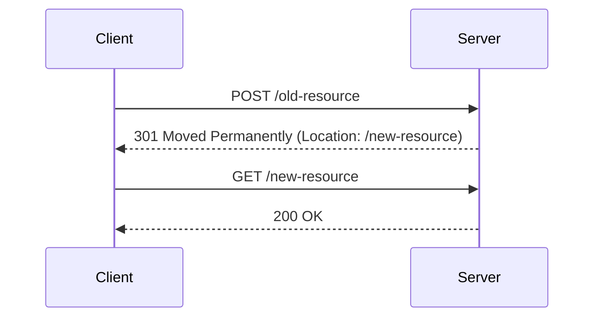
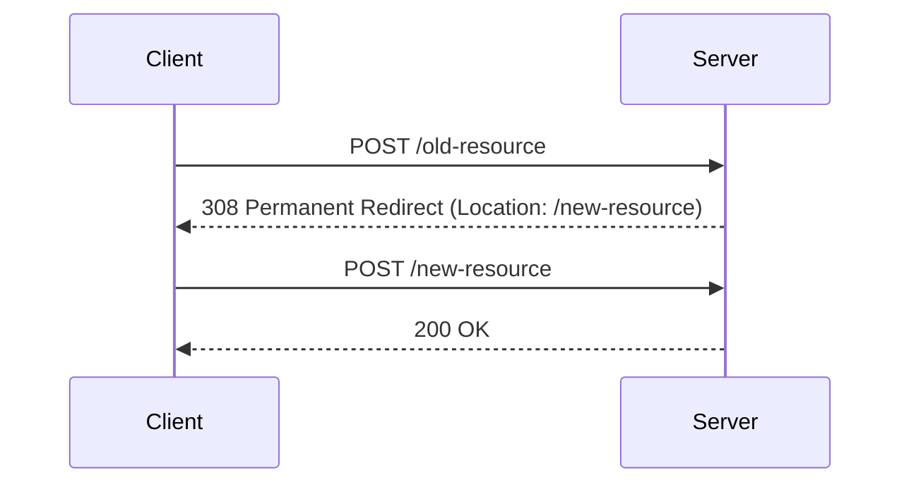

[mdn web docs | HTTP のリダイレクト](https://developer.mozilla.org/ja/docs/Web/HTTP/Redirections)にあるとおりだが、ここでは、レスポンスのLocationヘッダーにURIを指定する仕様となっているステータスコード(301, 302 ,303, 307, 308)についてまとめる。
また、HEADメソッドについての言及もここでは行わない。

## 恒久的リダイレクト(301, 308)と一時的リダイレクト(302, 303, 307)の違い

検索エンジンやブックマークで見てほしい参照先が、リダイレクト前なのか後なのかというところで恒久的、一時的のどちらを使うかがわかれる。
例えば、元々運営していたWebサイトを別のURLに移動した場合、以前使用したURLを使う予定は永遠にないため、この場合は恒久的リダイレクトを使うこととなる。
一方、メンテナンス等で一時的に別ページを表示したい場合や、認証関連のAPIで最終的に別のURLに遷移させたいが、元のURLへのリクエストが最初に行われる前提になっている場合は一時的リダイレクトを使うこととなる。

## リダイレクト前後でのリクエストメソッドが変わる(303)もしくは変わる可能性がある(301, 302)、変わらない(307, 308)の違い

例えば、レスポンスコード301と308は同じ恒久的リダイレクトだが、301はリダイレクト後のリクエストのメソッドが変わる可能性がある。
下記の例では、最初POSTでリクエストをしているが、リダイレクト後はGETでリクエストしている。

一方、308は変わらない。
下記の例では、最初POSTでリクエストし、リダイレクト後もPOSTでリクエストしている。

後者は、APIの移転やメンテナンスなどで役に立つ。

302と307は一時的リダイレクトであるが、301と308の関係と同じでリクエストメソッドが変わる可能性の有無の点で違う。

[mdn web docs | HTTP のリダイレクト](https://developer.mozilla.org/ja/docs/Web/HTTP/Redirections)や[RFC7231 | 6.4.2.  301 Moved Permanently](https://datatracker.ietf.org/doc/html/rfc7231#section-6.4.2)に記載があるが、仕様書ではメソッドの変更を意図してしなかったが、メソッドを変更するユーザーエージェントが存在した(RFCではこれを歴史的な理由と呼んでいるようだ)ため、GET以外のメソッドを使用するときに変更可能性がないことを示すために307と308が定義されたとのこと。

ここまでで、303に対する説明が漏れていた。
303は、リダイレクト前のリクエストメソッドがPUTもしくはPOSTで、リダイレクト後のリクエストメソッドがGETと決まっているときに使う。

## まとめ

ここまでの情報をまとめると、以下になる。

| ステータスコード | メソッド変更可能性 | 恒久的or一時的 |いつ使うべきか| 具体的な利用ケース |
| ---- | ---- | ---- | --- | --- |
| 301 | ある | 恒久的 | 前後がGETで恒久的 | Webサイト移転 |
| 302 | ある | 一時的 | 前後がGETで一時的| Webサイトメンテナンス |
| 303 | 前:PUT or POST, 後:GET のみ| 一時的 |前:PUT or POST, 後:GET のみ| フォーム送信後のサンクスページ |
| 307 | なし | 一時的 |前後がGET以外で一時的| WebAPIの移転 | 
| 308 | なし | 恒久的 |前後がGET以外で一時的| WebAPIのメンテナンス |

