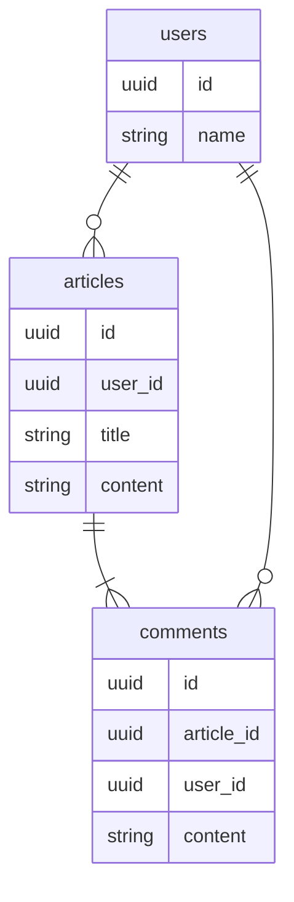

# はじめに

PostgreSQLで大量のダミーテストデータを作成するとき、やったことをまとめる。
本記事では、以下のER図・DDLのテーブル構造に入れるデータ投入するためのSQLについて説明する。

## ER図



## DDL

```sql
CREATE TABLE users(
    id uuid PRIMARY KEY DEFAULT gen_random_uuid(), 
    name varchar(255) NOT NULL
);

CREATE TABLE articles(
    id uuid PRIMARY KEY DEFAULT gen_random_uuid(), 
    user_id uuid NOT NULL, title varchar(255) NOT NULL, 
    content text NOT NULL
);

CREATE TABLE comments(
    id uuid PRIMARY KEY DEFAULT gen_random_uuid(), 
    article_id uuid NOT NULL, 
    user_id uuid NOT NULL, 
    content text NOT NULL
);

ALTER TABLE articles
    ADD CONSTRAINT articles_user_id_fkey
    FOREIGN KEY(user_id) REFERENCES users(id);

ALTER TABLE comments 
    ADD CONSTRAINT comments_article_id_fkey 
    FOREIGN KEY(article_id) REFERENCES articles(id);

ALTER TABLE comments 
    ADD CONSTRAINT comments_user_id_fkey 
    FOREIGN KEY(user_id) REFERENCES users(id);
```

# やったこと

## 任意の数のデータを用意する

例えばusersテーブルにデータを10000件入れるとき、generate_seriesを使う。

```sql
INSERT INTO users(
    name
)
SELECT 
    'ユーザー' || lpad(gs :: text, 5, '0') 
FROM generate_series(1, 10000) gs;
```

## 1つの親レコードに対する子レコードを任意の数作成する

usersテーブルのレコード1件に対して100件のarticlesのデータを作成するとき、以下のやり方がある。

### すべての親レコードに対して子レコードを作成する

例えば、先程作成したusersのデータ10000件とgenerate_series(1, 100)の1~100のデータ100件をCROSS JOINすると、これらのデータ全組み合わせ分100万件を作成できる。

```sql
INSERT INTO articles(
    user_id,
    title,
    content
)
SELECT 
    users.id,
    users.name || 'の' || lpad(gs :: text, 3, '0') || '番目の記事',
    users.name || 'の' || lpad(gs :: text, 3, '0') || '番目の記事の中身だよ'
FROM users, generate_series(1, 100) gs;
```

### 一部の親レコードに対して子レコードを作成する

親レコードを絞る場合はサブクエリを用いて、上記と同様にCROSS JOINする。

```sql
INSERT INTO articles(
    user_id,
    title,
    content
)
SELECT
    sub1.user_id,
    sub1.name || 'の' || lpad(gs :: text, 3, '0') || '番目の記事',
    sub1.name || 'の' || lpad(gs :: text, 3, '0') || '番目の記事の中身だよ'
FROM (
    SELECT 
        users.id user_id,
        users.name 
    FROM users limit 50
) sub1 CROSS JOIN
generate_series(1, 100) gs;
```

## 複数の親を持つ子レコードを任意の数作成する

commentsテーブルのレコードは、コメント対象のarticlesのレコードとコメントするusersのレコードに紐付いている。

### 全組み合わせデータを作成する場合

任意のartcilesとusersの全組み合わせのcommentsレコードを作成する場合は、CROSS JOINでサブクエリ同士を結合してINSERTするデータを作成する。

```sql
INSERT INTO comments(
    article_id,
    user_id,
    content
)
SELECT
    sub1.article_id,
    sub2.user_id,
    sub1.title || 'への' || sub2.user_name || 'へのコメント'
FROM (
    SELECT 
        id article_id,
        title title
    FROM
        articles
    limit 50
) sub1 CROSS JOIN (
    SELECT
        id user_id,
        name user_name
    FROM
        users
    limit 10
) sub2 
```

### 1対Nのデータを作成する

CROSS JOINは複数の表の全組み合わせをつくるための構文である。
組み合わせ網羅が必要でない、1件に対して数件紐付けたい場合などは、組み合わせたい表の双方に共通の値を作成して、その値を使って内部結合する。

#### 1対1

以下の例だとrow_number()という[ウィンドウ関数](https://www.postgresql.org/docs/current/functions-window.html)を使って、番号列を追加するサブクエリを双方のテーブルで作成し、その番号列で結合した結果を使って挿入している。

```sql
INSERT INTO comments(
    article_id,
    user_id,
    content
)
SELECT
    article_id,
    user_id,
    content
FROM (
    SELECT
        sub1.article_id article_id,
        sub2.user_id user_id,
        sub1.title || 'に' || sub2.user_name || 'がするコメント' as content
    FROM (
        SELECT 
            id article_id,
            title title,
            row_number() over() as row_num
        FROM
            articles
    ) sub1 JOIN (
        SELECT
            id user_id,
            name user_name,
            row_number() over() as row_num
        FROM
            users
    ) sub2 ON sub1.row_num = sub2.row_num
) sub3;
```

### 1対N

上記の片方のサブクエリの番号列を`row_number() over() / 3 as row_num`のように変えると、行番号を3で割った商をrow_numとして使うことができる。
下記の例だと1つの記事に対してユーザーを上から3人ずつコメントしているような関連を作れる。

```sql
INSERT INTO comments(
    article_id,
    user_id,
    content
)
SELECT
    article_id,
    user_id,
    content
FROM (
    SELECT
        sub1.article_id article_id,
        sub2.user_id user_id,
        sub1.title || 'に' || sub2.user_name || 'がするコメント' as content
    FROM (
        SELECT 
            id article_id,
            title title,
            row_number() over() as row_num
        FROM
            articles
    ) sub1 JOIN (
        SELECT
            id user_id,
            name user_name,
            row_number() over() / 3 as row_num   -- <- ここを変えた
        FROM
            users
    ) sub2 ON sub1.row_num = sub2.row_num
) sub3;
```

# まとめ

- [generate_series](https://www.postgresql.org/docs/current/functions-srf.html)とCROSS JOINで組み合わせデータをたくさん作れる。
- [row_number()](https://www.postgresql.org/docs/current/functions-window.html)等のウィンドウ関数を使って、無関係のテーブルのデータを結合する。